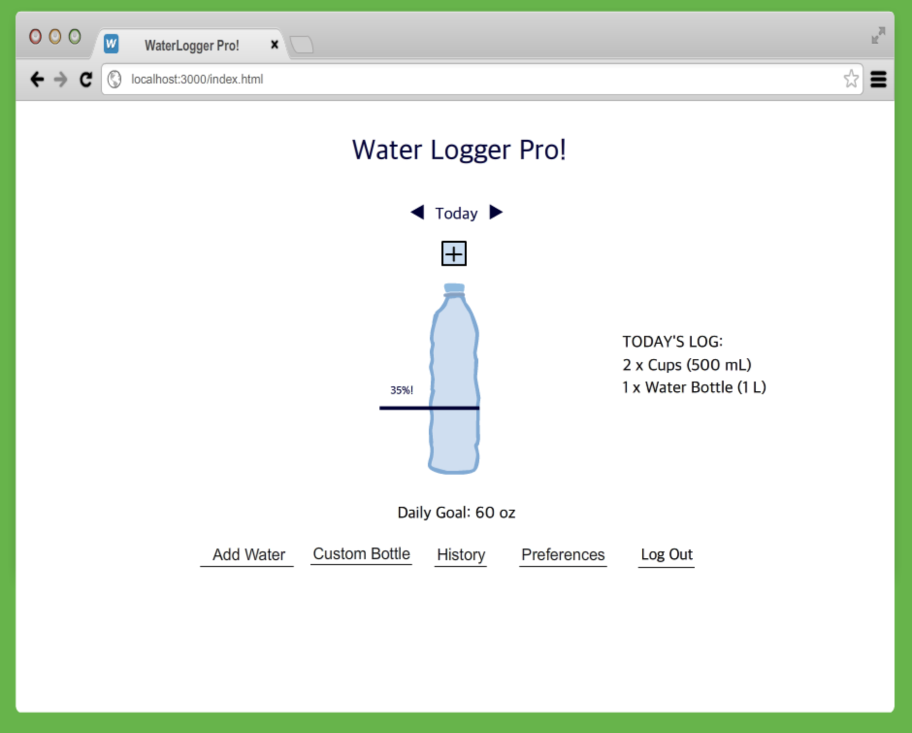
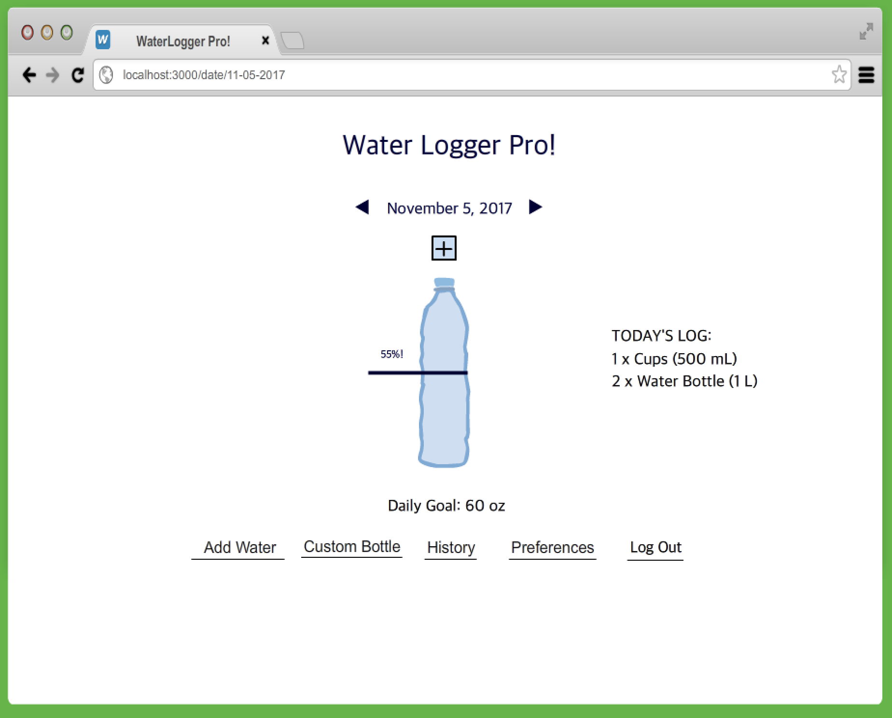
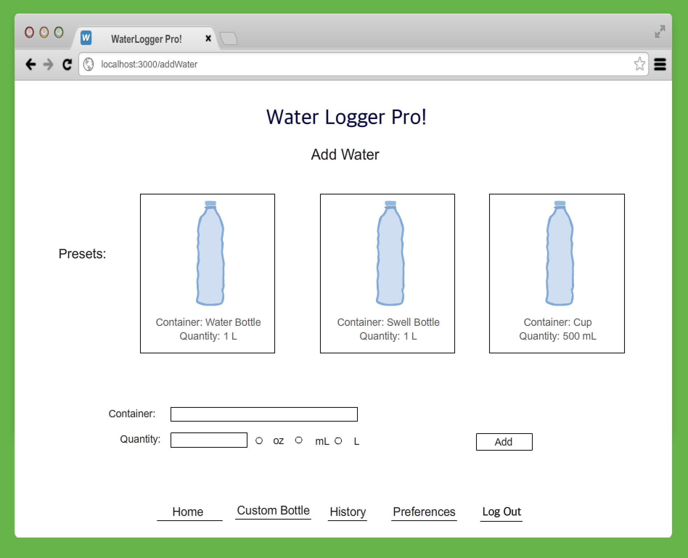
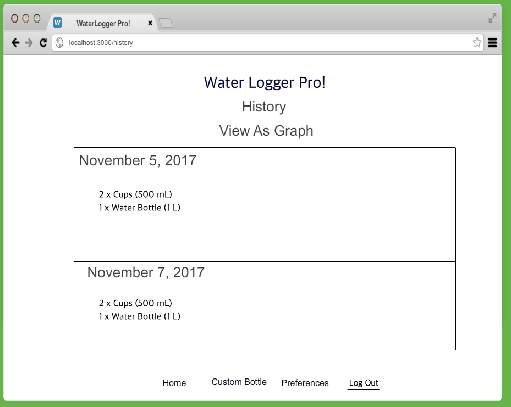
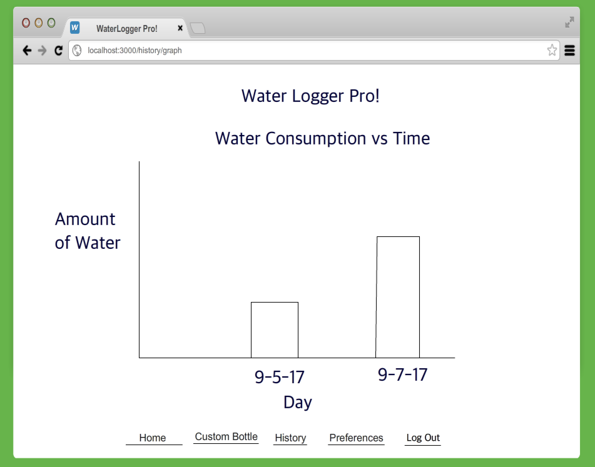
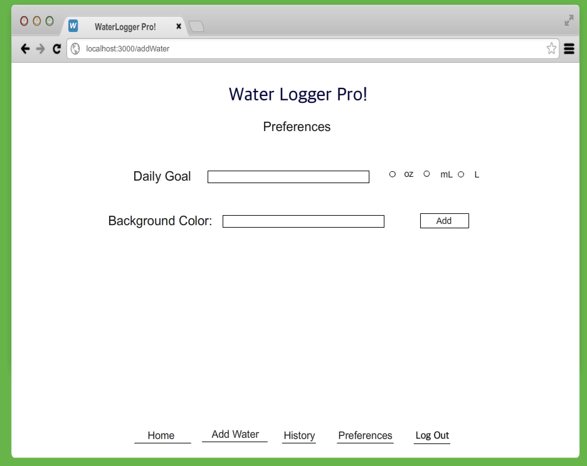
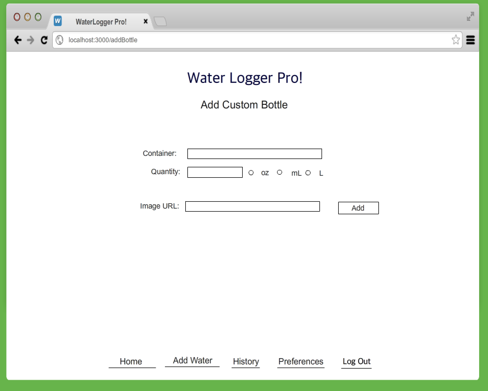
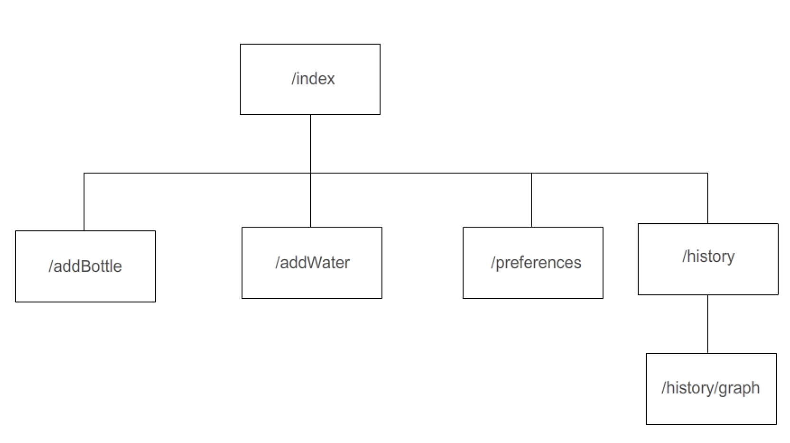

# Waterlogger Pro

## Overview

Throughout the day, there is one constant in our lives: water consumption. There is water in everything, and sometimes it's just too hard to keep track of how much you've had throughout the day! Thanks to Waterlogger Pro, we finally have a trendy, web solution!

Waterlogger Pro is a web app that will allow users to track daily water consumption. Users can register and login. Once they're logged in, they can set up their daily goal and log what they have been drinking throughout the day. The application will display the percent of daily goal reached, and store each day's worth of logs in a database. The app will also allow you to view your daily water consumption in a graph to track overall healthy well-being. Users are also free to set custom water amounts, as well as use the preset amounts for ease of use and access.

## Data Model

The application will store Users, water logs (list called log per date the app is used), custom water amounts, and preferences. Each user has an array of dates where they logged water consumption. Each date is its own seperate object detailing the water consumed (container, quantity, unit). Each user has specified preferences, such as their preferred background color, daily goal, and unit of water measurement (oz, mL, L). 

* Users can have multiple dates (via references)
* each date can have multiple objects, numbers, and strings (by embedding)

An Example User:

```javascript
{
  username: "dannydk6",
  hash: // a password hash,
  dates: // an array of references to dates documents,
  preferences: {backgroundColor: "#FF0000", preferredUnit: "oz", dailyGoal: 60}
  currentAmount: 43, // percent of daily goal reached.
  customBottles: //an array of references to container documents.
}
```

An Example Dates with Embedded objects, numbers, and strings:

```javascript
{
  user: // a reference to a User object,
  month: 9,
  day: 18,
  year: 2017,
  logs: [
    { container: "Cup", quantity: "8", unit: "oz", 
    img: "/public/img/cupDefault.png", createdAt: "10:20:21"},
    { container: "Water bottle", quantity: "500", unit: "mL", 
    img: "public/img/waterBottleDefault.png", createdAt: "13:23:21"},
  ]
}
```
An Example Container with embedded numbers, and strings:

```javascript
{
  user: // a reference to a User object,
  container: "Fiji bottle",
  quantity: 700,
  unit: "mL",
  img: "/public/img/fijiBottle.png"
}
```

## [Link to Commented First Draft Schema](db.js) 

## Wireframes

/index or / - Home screen. It can redirect to adding water, preferences, creating custom bottles, and history.
It displays the daily goal and current percent progress made for the day. 



/date/slug - Slug version of home-screen. It displays the daily goal and current percent progress made for past or future days depending on the arrow press.



/addWater - Screen for adding water logs for a date.



/history - See all logs made on this account.



/history/graph - Overall view of water consumption in a graph.



/preferences - Change your daily goal amount and background color.



/addBottle - Add a custom bottle to bottle presets.



## Site map



## User Stories or Use Cases

1. as non-registered user, I can register a new account with the site.
2. as a user, I can log in and out of the site.
3. as a user, I can log water consumption for a given date.
4. as a user, I can view the history of all my logs per date.
5. as a user, I can make custom bottle amounts, and upload a picture of the bottle.
6. as a user, I can set my daily goal for water consumption, units, and website color.
7. as a user, I can view my daily current and past progress based on my goal.
8. as a user, I can view a graph plotting my water consumption per day over time. 

## Research Topics

* (5 points) Integrate user authentication
    * I'm going to be using passport for user authentication
    * User can have a way of accessing his/her own data store for water consumption
* (2 points) Bootstrap
    * Will use Bootstrap for a better and sleeker design. 
* (1 point) Charts.js
    * Allows creation of charts with an easy API. The chart graphs water consumption per day over time.

8 points total out of 8 required points

## [Link to Initial Main Project File](app.js) 

## Annotations / References Used

1. [passport.js authentication docs](http://passportjs.org/docs) 
3. [chartsjs website](http://www.chartjs.org/)
4. [Bootstrap website](https://getbootstrap.com/)
